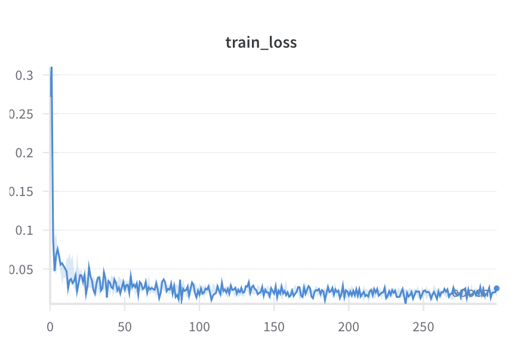
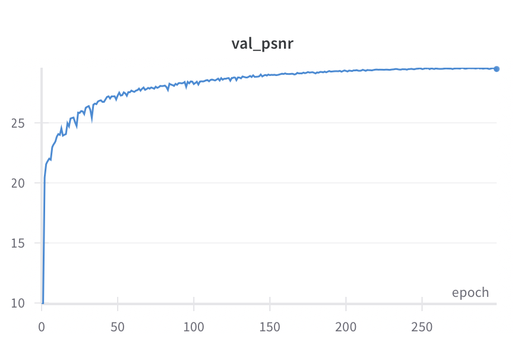

# NYCU Computer Vision 2025 Spring HW4

**Student ID:** 111550135  
**Name:** 林李奕 (Li-Yi Lin)

---

## Introduction

This repository contains my solution for **HW4 – Image Restoration for Rain & Snow**.  
The goal is to train a **single model** that removes both rain streaks and snowflakes from images, **without** using any external data or pretrained backbones.  

The final model achieves **31.69 dB PSNR** on the public test set (9ᵗʰ place on the leaderboard).

---

## Quick Start

### 1. Clone & Environment

```bash
git clone https://github.com/owo0505/NYCU-Computer-Vision-2025-Spring-HW4.git
cd NYCU-Computer-Vision-2025-Spring-HW4

# (optional) create and activate conda environment
conda env create -f env.yml
```

### 2. Prepare Data
Download the course dataset and place it under:

/path/to/hw4_realse_dataset/train/{degraded,clean}/*.png
Run the deterministic 80/20 split:

```bash
python split.py
```
This will generate /path/to/hw4_split/ containing:

hw4_split/
 ├─ train/
 │  ├─ degraded/
 │  └─ clean/
 │
 ├─ val/
 │  ├─ degraded/
 │  └─ clean/
 │
 └─ split.json

### 3. Train from Scratch
```bash
python train.py \
  --cuda 0 --num_gpus 1 --epochs 300 \
  --batch_size 4 --lr 2e-4 --patch_size 192 \
  --num_workers 8 --de_type derain desnow \
  --derain_dir /path/to/hw4_split \
  --output_path experiments/hw4_c
```

### 4. Inference (with 8× TTA)
```bash
python inference.py
```

### 5. Results

| Model ID                          | TTA         | Public Test PSNR     |
|-----------------------------------|-------------|----------------------|
| **epoch=299-step=192000.ckpt**    | No          | 30.23                |
| **epoch=299-step=192000.ckpt**    | Yes         | 31.69                |

  
 
 